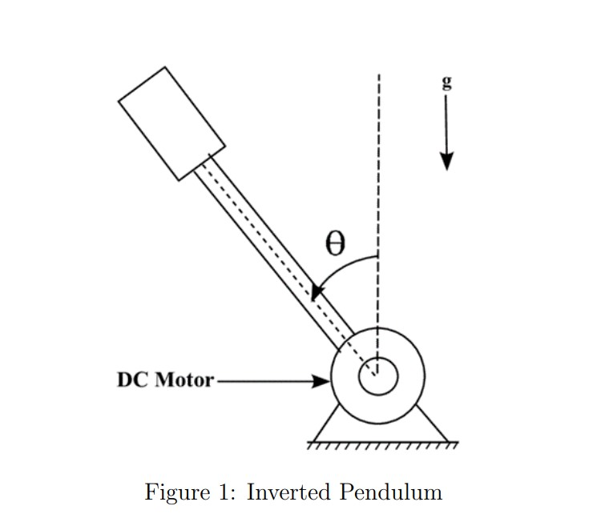
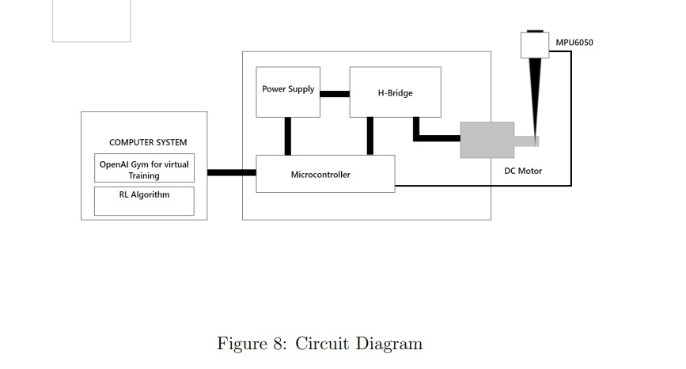
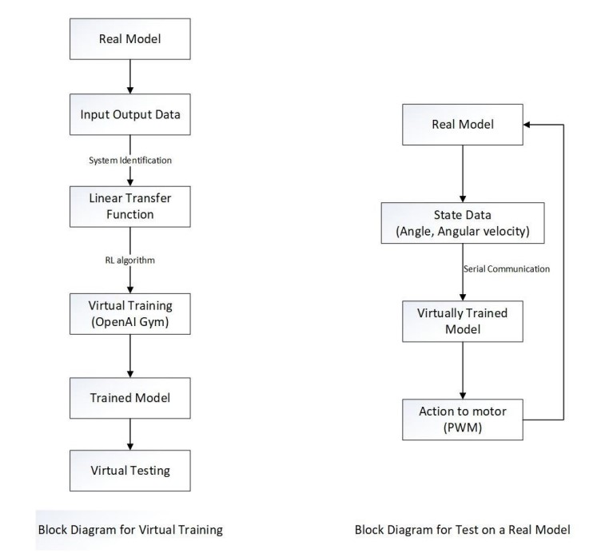
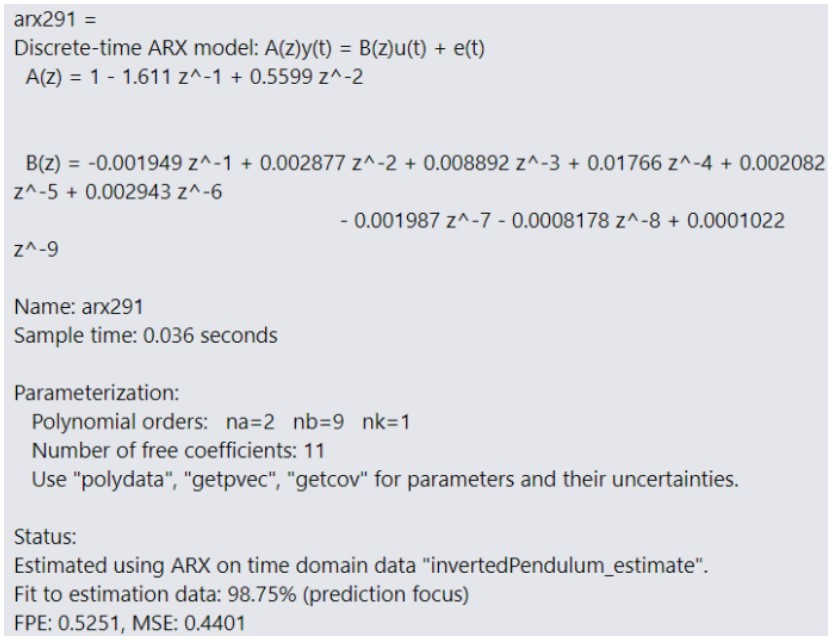
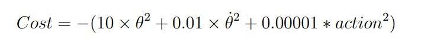

# Stabilizing Inverted Pendulum Using System Identification and Reinforcement Learning

This project aims to solve two problems. The problem with traditional control system that fails to adapt as the system changes. The problem with reinforcement learning that needs training on a real model for a long time that might not be possible on some cases. We try to balance inverted pendulum virtually by using the system equation given by system identification and directly balance the real model.

The circuit diagram is

The process is shown in the diagram

The ARX equation describing the actual system

The cost function used to train the system

The softwares used are
1. OpenAI Gym
2. Arduino IDE
3. System Identification Toolbox in MatLab
4. Python and Tensorflow

Proximal Policy Optimization(PPO) algorithm was used to train the system.

The final testing concluded the system to be balanced in the range of 10 degrees.

